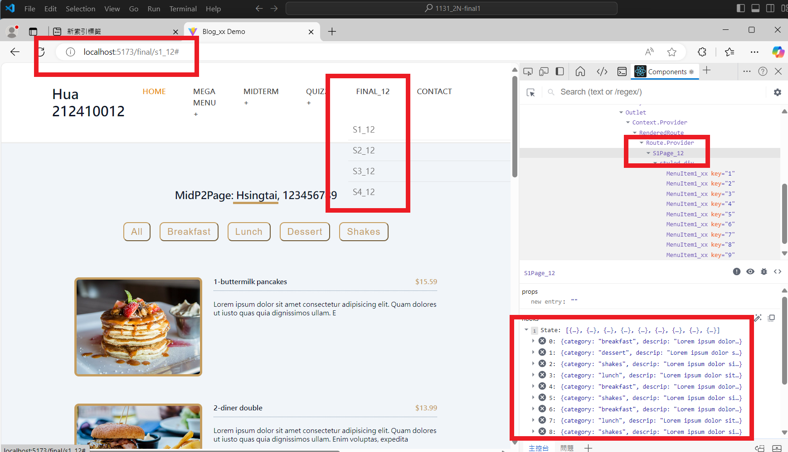
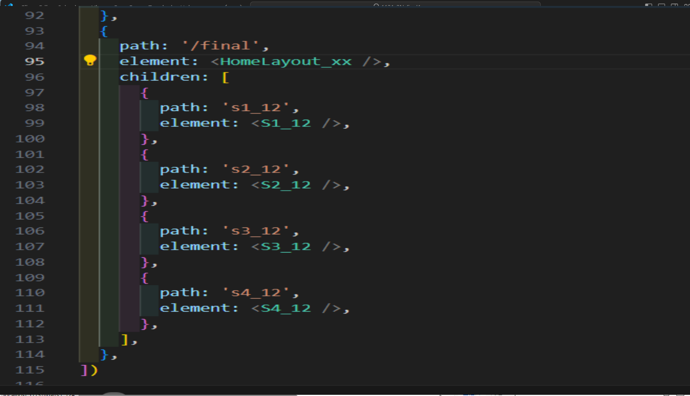
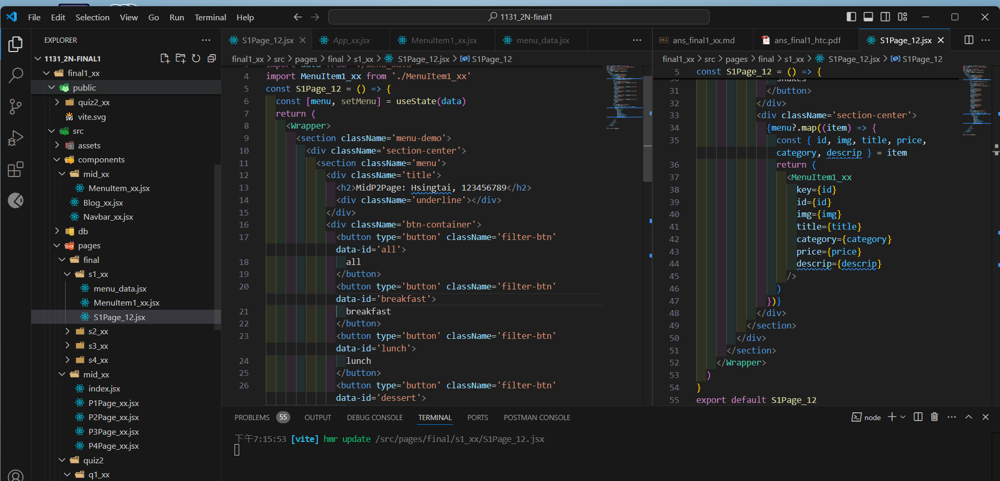
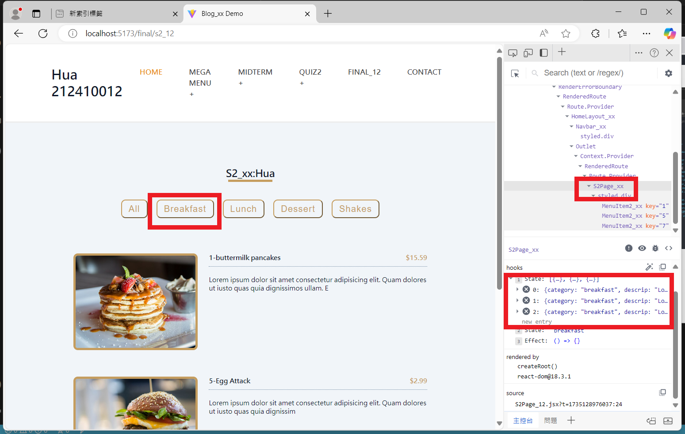
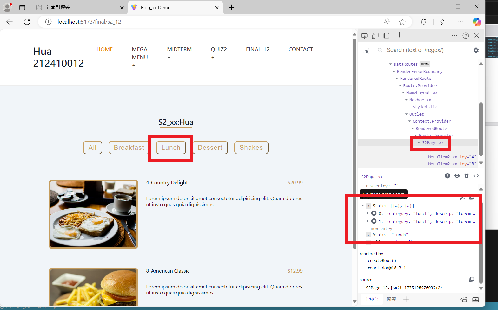
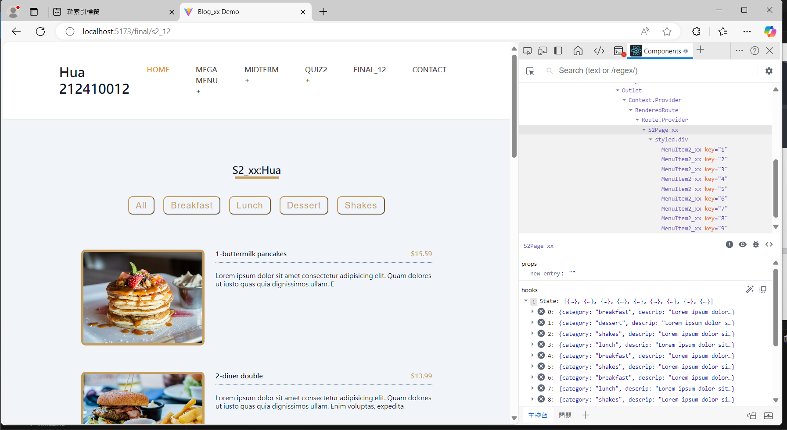
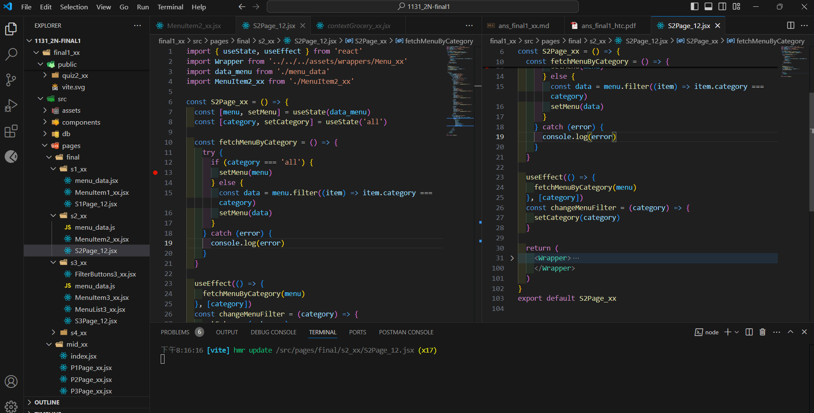
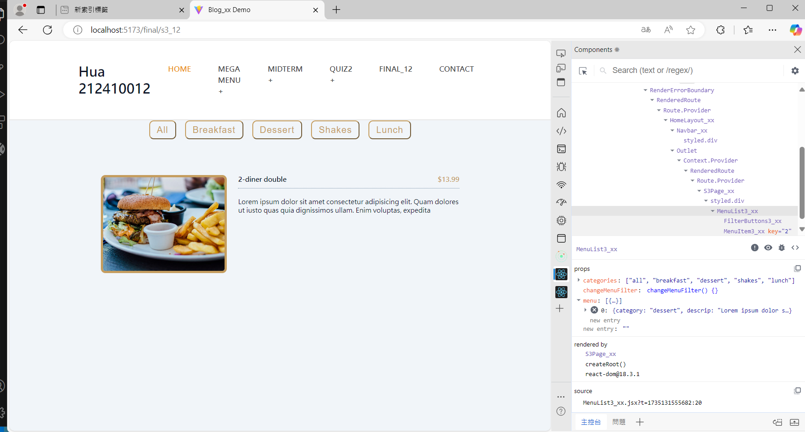
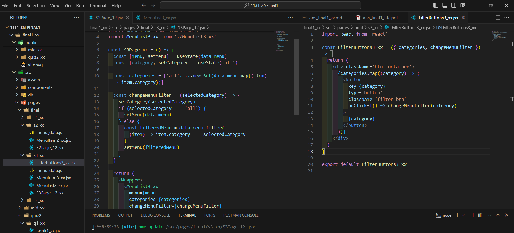
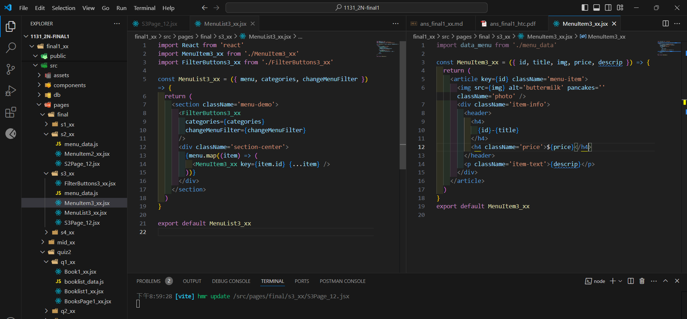

# (60%) Web 程式設計一 期末考 1 -- 斷網考試

##### 2024-12-25, at E201, 18:20~18:50

#### Note:

1. 請不要發揮同學愛，作弊雙方除了本次考試 0 分外，平常分數另扣 20 分，情節嚴重者會送校。
2. iClass 上請繳交 ans_final1_xx.pdf，還有 md_final1_xx.zip, src.zip 三個壓縮檔，壓縮前請將 node_modules 全部砍掉
3. 請直接將答案寫在 md_final1_xx/ans_final1_xx.md 上，老師出題及圖片放在 ans_final1_htc.pdf 上，請依照老師所給的圖片來實作並標註
4. 跟小考相關的檔案及目錄名稱有 xx 時，必須要改成學號後 2 碼，沒有修改時，會視違犯情況扣分。
5. 每一張圖片要有機房左側背景，圖片上要有你的學號(或後兩碼)，圖片標註要跟老師所標註的類似。違者會依情節扣分。
6. 請自評分數，將每一題的 ? 填入分數，沒有填者，不會批改，以 0 分計算。

##### Your (Name, ID): (Hua, 212410012)

- P1 (15%): 15 分
- P2 (14%): 14 分
- P3 (14%): 14 分
- P4 (18%): 0 分

##### 總分: 43 分

---

#### (15%) P1: 由選單 Final_xx，選擇 S1_xx，透過路由 /final/s1_xx，顯示上課 menu demo 所用到的 9 張圖片，如下圖

請自行從 pages/mid_xx 目錄下之檔案擷取本題所需要的 code，放入 final/s1_xx 目錄下，主要有兩個檔案 S1Page_xx.jsx 及 MenuItem1_xx.jsx。

9 筆資料放在 menu_data.jsx，所用到的圖片放在 public/mid_xx 下，可能需要編輯以便能取得圖片。

##### => Chrome 顯示，請點選 Final_xx 下之 S1_xx

#### Your Answer

##### => Chrome 顯示，點選 S1Page_xx，可以看到

##### => 顯示 App_xx.jsx 中的 /final/s1_xx 路由設定 code 重點顯示

##### => 顯示 S1Page_xx.jsx code 重點顯示

---

#### (14%) P2: 將 P1 複製一份到 P2，由選單 Final_xx，選擇 S2_xx，透過路由 /final/s2_xx，可以顯示 S2Page2_xx.jsx 頁面，並且可以完成 filter 按鈕功能 (本題不需要存取 local storage)

##### => 將 s1_xx 目錄內之檔案，複製一份到 s2_xx，並改名如下圖 (基本上將數字 1 改成 2)，

##### => Chrome 顯示，請點選 Final_xx 下之 S2_xx，再點選 Breakfast

##### => 點選 Lunch 之 Chrome 顯示

##### => 點選 All 之 Chrome 顯示

#### Your Answer

##### => 點選 Breakfast 之 Chrome 顯示

##### => 點選 Lunch 之 Chrome 顯示

##### => 點選 All 之 Chrome 顯示

##### => 顯示 S2Page_xx.jsx code 重點顯示

---

#### (14%) P3: 延續 P2，將 S2Page_xx.js 之顯示拆成 S3Page_xx.jsx, FilterButtons3_xx.jsx, MenuList3_xx.jsx, MenuItem3_xx.jsx，由選單 Final_xx，選擇 S3_xx，透過路由 /final/s3_xx，可以顯示 S3Page_xx.jsx

本題不需要存取 local storage

##### => 請複製 P2 檔案到 P3 目錄，並且改名，目錄檔案結構如下圖

##### => Chrome 顯示，請點選 Final_xx 下之 S3_xx，再點選 Dessert 只有一筆，截圖要能顯示細緻化的 components，如下說明

全部按鈕請放入 FilterButtons3_xx.jsx 中
全部 menu 先放入 MenuList3_xx.jsx，再透過 MenuItem3_xx.jsx 顯示單一 menu。

#### Your Answer

##### => Chrome 顯示 Dessert 只有一筆，截圖要能顯示細緻化的 components

##### => 顯示 S3Page_xx.jsx, FilterButtons3_xx.jsx code 重點顯示

##### => 顯示 S3MenuList3_xx.jsx, MenuItem3_xx.jsx code 重點顯示

---

#### (18%) P4: 將 P3 改成以 context api 來實作，由選單 Final_xx，選擇 S4_xx，透過路由 /final/s4_xx，可以顯示 S4Page_xx.jsx

本題需要存取 local storage。

##### => 請從 P3 將檔案複製到 P4 目錄，並改名，目錄檔案結構如下圖，

##### => Chrome 顯示，請點選 Final_xx 下之 S4_xx， 點選 Shakes，透過 Chrome DevTools 之 components 顯示 3 筆 shakes 資料，

##### =>=> 點選 Shakes，透過 Chrome DevTools 之 Application 顯示 3 筆 shakes 資料於 local storage 之 menu-list 中

#### Your Answer

##### => 點選 Shakes，透過 Chrome DevTools 之 components 顯示 3 筆 shakes 資料，

##### =>=> 點選 Shakes，透過 Chrome DevTools 之 Application 顯示 3 筆 shakes 資料於 local storage 之 menu-list 中

##### => 顯示 contextMenu_xx.jsx 之 code 重點

##### => 顯示 S4Page_xx.jsx 之 code 重點

##### => 顯示 FilterButtons4_xx.jsx 之 code 重點

##### => 顯示 MenuList4_xx.jsx 之 code 重點

